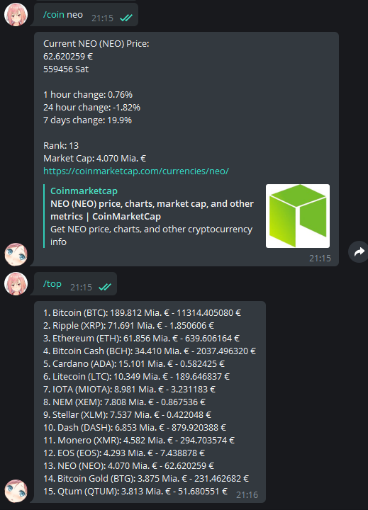

Telegram Crypto Currency Bot
=====================

A simple crypto currency bot for my telegram group (or private chats!) based on [python-telegram-bot](https://github.com/python-telegram-bot/python-telegram-bot) and the newest Python 3. The bot uses the [coinmarketcap.com API](https://coinmarketcap.com/api/) to obtain all data.

Commands List
-------------
Command | Discription | Usage
----------------|--------------|-------
`/btc` | Shows the current price of one Bitcoin in Euro | `/btc`
`/eth` | Shows the current price of one Ether in Euro | `/eth`
`/coin` | Shows the current price of one given cryptocurrency. You need to specify the `id` listed from [coinmarketcap.com](https://coinmarketcap.com/api/), which is basically the full name in lowercase and `-` as seperators | `/coin ethereum`, `/coin neo`
`/top` | Shows the current top crypto currency based on their market cap | `/top`
`/github` | Displays a link to the GitHub Repository | `/github`

List to copy for [@BotFather](https://telegram.me/BotFather):

    btc - Shows the current price of one Bitcoin in Euro
    eth - Shows the current price of one Ether in Euro
    coin - Shows the current price of one given cryptocurrency
    top - Shows the current top crypto currency based on their market cap
    github - Displays a link to the GitHub Repository

Run
-------------
Either run it directly via `python3 main.py` or use systemd. An example for a systemd service can be found at `telegram.service.example`:

    [Unit]
    Description=Telegram Crypto Bot
    After=multi-user.target
    [Service]
    WorkingDirectory=/home/eddy/telegram_bot
    User=eddy
    Group=eddy
    ExecStart=/usr/bin/python3.6 /home/eddy/telegram_bot/main.py
    Type=idle
    Restart=on-failure
    RestartSec=15
    TimeoutStartSec=15

    [Install]
    WantedBy=multi-user.target

Settings
-------------
Currently there is only one setting to be made, the token for the bot account. Copy `config.example.py` to `config.py` and add your Telegram API token from your bot.

    __TOKEN__ = 'tspOGQiAoEqdEEEBzinmhJg4VuvenEzKiH39NzsZQqDDq'

Don't forget to allow groups at [@BotFather](https://telegram.me/BotFather) if you want to add the bot to groups.

List of requirements
-------------

    python>=3.6.0
    python-telegram-bot
    requests

License
-------------

    MIT License

    Copyright (c) 2017 - 2018 Eduard Nikoleisen <Der-Eddy>

    Permission is hereby granted, free of charge, to any person obtaining a copy
    of this software and associated documentation files (the "Software"), to deal
    in the Software without restriction, including without limitation the rights
    to use, copy, modify, merge, publish, distribute, sublicense, and/or sell
    copies of the Software, and to permit persons to whom the Software is
    furnished to do so, subject to the following conditions:

    The above copyright notice and this permission notice shall be included in all
    copies or substantial portions of the Software.

    THE SOFTWARE IS PROVIDED "AS IS", WITHOUT WARRANTY OF ANY KIND, EXPRESS OR
    IMPLIED, INCLUDING BUT NOT LIMITED TO THE WARRANTIES OF MERCHANTABILITY,
    FITNESS FOR A PARTICULAR PURPOSE AND NONINFRINGEMENT. IN NO EVENT SHALL THE
    AUTHORS OR COPYRIGHT HOLDERS BE LIABLE FOR ANY CLAIM, DAMAGES OR OTHER
    LIABILITY, WHETHER IN AN ACTION OF CONTRACT, TORT OR OTHERWISE, ARISING FROM,
    OUT OF OR IN CONNECTION WITH THE SOFTWARE OR THE USE OR OTHER DEALINGS IN THE
    SOFTWARE.
